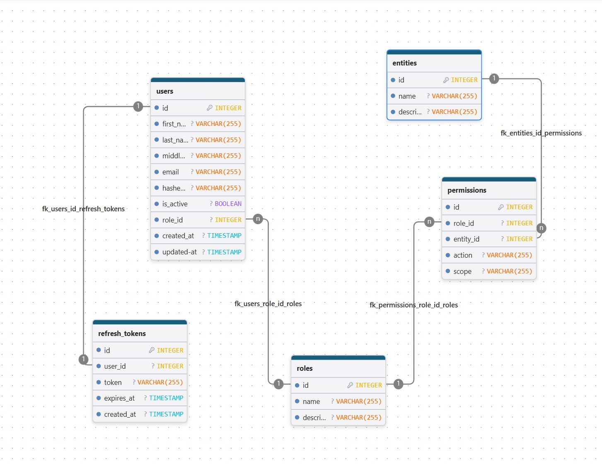

# AuthSystem

Система аутентификации и авторизации на основе **RBAC**, построенная на FastAPI.


При запуске эндпоинта /seed/ происходит заполнение бд тестовыми данными, добавляется юзер admin с почтой **admin@admin.com** и паролем **admin123**
    по этим данным вы можете зайти и проверить работу остальных эндпоинтов

---

## Стек технологий

- **FastAPI** - веб-фреймворк
- **PostgreSQL** - база данных
- **SQLAlchemy 2.0** - ORM (async)
- **Alembic** - миграции
- **bcrypt** - хеширование паролей
- **Docker / Docker Compose** - контейнеризация
- **pytest + httpx** - тестирование

---


## Схема базы данных



## Архитектура проекта

```
AuthSystem/
├── src/
│   ├── api/                        # Роутеры (эндпоинты)
│   │   ├── auth.py                 # Регистрация, логин, логаут, refresh
│   │   ├── users.py                # Профиль пользователя
│   │   ├── roles.py                # Управление ролями (admin)
│   │   ├── entities.py             # Управление сущностями (admin)
│   │   ├── permissions.py          # Управление правами (admin)
│   │   ├── mock.py                 # Mock бизнес-объекты (products, orders, shops)
│   │   ├── seed.py                 # Seed скрипт (роли, права, админ)
│   │   └── dependencies.py         # FastAPI dependencies
│   ├── migrations/                 # Alembic миграции
│   │   └── versions/
│   ├── models/                     # SQLAlchemy ORM модели
│   │   ├── __init__.py
│   │   ├── entities.py
│   │   ├── permissions.py
│   │   ├── refresh_tokens.py
│   │   ├── roles.py
│   │   └── users.py
│   ├── repositories/               # Слой работы с БД
│   │   ├── mappers/
│   │   │   ├── base.py             # Базовый маппер ORM → Pydantic
│   │   │   └── mappers.py          # Конкретные мапперы
│   │   ├── base.py                 # Базовый репозиторий (CRUD)
│   │   ├── entities.py
│   │   ├── permissions.py
│   │   ├── refresh_tokens.py
│   │   ├── roles.py
│   │   └── users.py
│   ├── schemas/                    # Pydantic схемы
│   │   ├── entities.py
│   │   ├── permissions.py
│   │   ├── refresh_tokens.py
│   │   ├── roles.py
│   │   └── users.py
│   ├── services/                   # Бизнес-логика
│   │   ├── base.py
│   │   ├── entities.py
│   │   ├── permissions.py
│   │   ├── refresh_tokens.py
│   │   ├── roles.py
│   │   └── users.py
│   ├── utils/
│   │   ├── auth.py                 # JWTManager, PasswordManager
│   │   ├── database.py             # DBManager
│   │   └── exceptions.py           # Кастомные исключения
│   ├── config.py                   # Настройки через pydantic-settings
│   ├── database.py                 # SQLAlchemy engine, Base
│   └── main.py                     # Точка входа
├── tests/
│   ├── e2e_tests/
│   │   └── test_auth.py
│   ├── integration_tests/
│   │   ├── auth/
│   │   ├── entities/
│   │   ├── mock/
│   │   ├── permissions/
│   │   ├── roles/
│   │   └── users/
│   ├── unit_tests/
│   │   └── test_auth.py
│   └── conftest.py
├── .env-example
├── .env-local
├── .env-test
├── alembic.ini
├── db_schema.jpg                   # Схема БД
├── docker-compose.yml
├── Dockerfile
├── poetry.lock
├── pyproject.toml
├── pytest.ini
├── README.md
└── seed_scripts.py                 # Запуск seed скрипта
```

---


## Система RBAC

Доступ контролируется через таблицу `permissions` по трём параметрам:

| Параметр  | Описание          | Пример                               |
|-----------|-------------------|--------------------------------------|
| `role`    | Роль пользователя | `admin`, `manager`, `user`           |
| `entity`  | Объект приложения | `products`, `orders`, `shops`        |
| `action`  | Действие          | `read`, `create`, `update`, `delete` |
| `scope`   | Область действия  | `all` (любые), `own` (только свои)   |

### Права по умолчанию (из seed скрипта)

| Роль    | Action                       | Scope |
|---------|------------------------------|-------|
| admin   | read, create, update, delete | all   |
| manager | read, create                 | all   |
| manager | update                       | own   |
| user    | read                         | all   |

### Как работает проверка доступа

При каждом запросе к защищённому эндпоинту:

```
1. Достаём JWT токен из httpOnly cookie
2. Декодируем токен - получаем role и user_id
3. Ищем в таблице permissions запись: role + entity + action
4. Не найдено - 403 Forbidden
5. Найдено, scope=all - пропускаем
6. Найдено, scope=own - проверяем что объект принадлежит пользователю
```

---

## Аутентификация

### JWT (собственная реализация)

Токены создаются вручную через `HMAC-SHA256` без использования готовых библиотек авторизации:

- `header.payload.signature` - стандартный формат JWT
- Подпись создаётся через `hmac.new(secret, message, sha256)`
- Проверка подписи через `hmac.compare_digest` (защита от timing attacks)

### Два токена

| Токен            | TTL     | Хранение             | Назначение               |
|------------------|---------|----------------------|--------------------------|
| `access_token`   | 1 час   | httpOnly Cookie      | Авторизация запросов     |
| `refresh_token`  | 30 дней | httpOnly Cookie + БД | Обновление access токена |
 
Refresh токен хранится в БД - это позволяет инвалидировать его при логауте.

---

## API эндпоинты

### Аутентификация `/auth`

| Метод  | Путь                   | Описание                  | Доступ           |
|--------|------------------------|---------------------------|------------------|
| POST   | `/auth/register`       | Регистрация (роль user)   | Публичный        |
| POST   | `/auth/login`          | Логин, выдача токенов     | Публичный        |
| POST   | `/auth/logout`         | Логаут, удаление токенов  | Авторизованный   |
| POST   | `/auth/refresh`        | Обновление access токена  | Авторизованный   |

### Пользователи `/users`

| Метод  | Путь                     | Описание                      | Доступ         |
|--------|--------------------------|-------------------------------|----------------|
| GET    | `/users/me`              | Получить свой профиль         | Авторизованный |
| PATCH  | `/users/me`              | Обновить свой профиль         | Авторизованный |
| DELETE | `/users/me`              | Удалить аккаунт (soft delete) | Авторизованный |
| PATCH  | `/users/admin/{id}/role` | Изменить роль пользователя    | Только admin   |

### Администрирование

| Метод            | Путь                           | Описание                    |
|------------------|--------------------------------|-----------------------------|
| GET/POST         | `/admin/roles`                 | Список / создание ролей     |
| GET/DELETE       | `/admin/roles/{id}`            | Получить / удалить роль     |
| GET/POST         | `/admin/entities`              | Список / создание сущностей |
| GET/PATCH/DELETE | `/admin/entities/{id}`         | CRUD сущности               |
| GET/POST         | `/admin/permissions`           | Список / создание прав      |
| GET              | `/admin/permissions/role/{id}` | Права роли                  |
| PATCH/DELETE     | `/admin/permissions/{id}`      | Изменить / удалить право    |

### Mock бизнес-объекты `/mock`

| Метод                 | Путь                  | Требуемое право |
|-----------------------|-----------------------|-----------------|
| GET                   | `/mock/products`      | products:read   |
| POST                  | `/mock/products`      | products:create |
| PATCH                 | `/mock/products/{id}` | products:update |
| DELETE                | `/mock/products/{id}` | products:delete |
| GET/POST/PATCH/DELETE | `/mock/orders`        | orders:*        |
| GET/POST/PATCH/DELETE | `/mock/shops`         | shops:*         |

---

## Запуск

### Через Docker

```bash
# Создать сеть (один раз)
docker network create myNetwork

# Запустить
docker-compose up --build
```

### Локально

```bash
# Установить зависимости
poetry install

# Настроить .env-local
cp .env-example .env-local

# Запустить миграции
alembic upgrade head

# Заполнить БД начальными данными
python seed.py      (либо потом выполнить эндпоинт /seed/)

# Запустить сервер
uvicorn src.main:app --reload
```

---

## Тестирование

```bash
# Запустить все тесты
pytest -v

```

### Структура тестов

```
tests/
├── unit_tests/
│   └── test_auth.py              # JWTManager, PasswordManager
├── integration_tests/
│   ├── auth/test_api.py          # Тесты auth эндпоинтов
│   ├── users/test_api.py         # Тесты user эндпоинтов
│   ├── users/test_db.py          # Тесты репозитория users
│   ├── roles/test_api.py         # Тесты roles эндпоинтов
│   ├── roles/test_db.py          # Тесты репозитория roles
│   ├── entities/test_api.py      # Тесты entities эндпоинтов
│   ├── entities/test_db.py       # Тесты репозитория entities
│   ├── permissions/test_api.py   # Тесты permissions эндпоинтов
│   ├── permissions/test_db.py    # Тесты репозитория permissions
│   └── mock/test_api.py          # Тесты RBAC через mock ручки
└── e2e_tests/
    └── test_auth.py              # Полный цикл регистрация→логин→логаут
```

---

